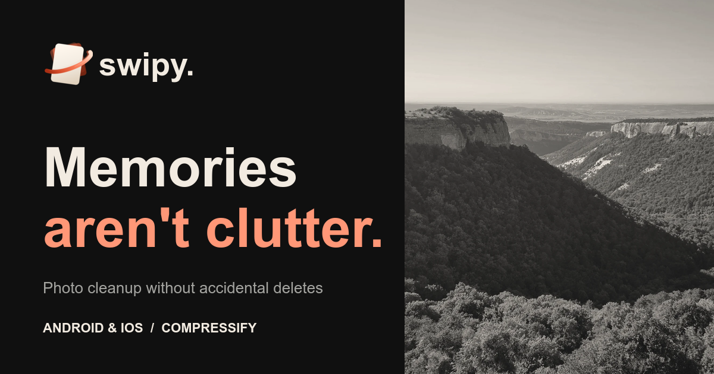
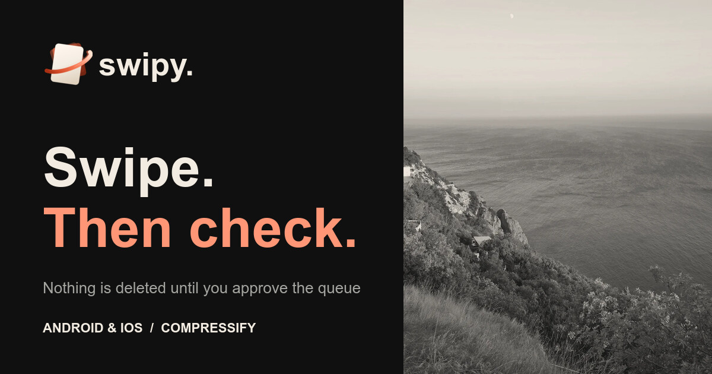
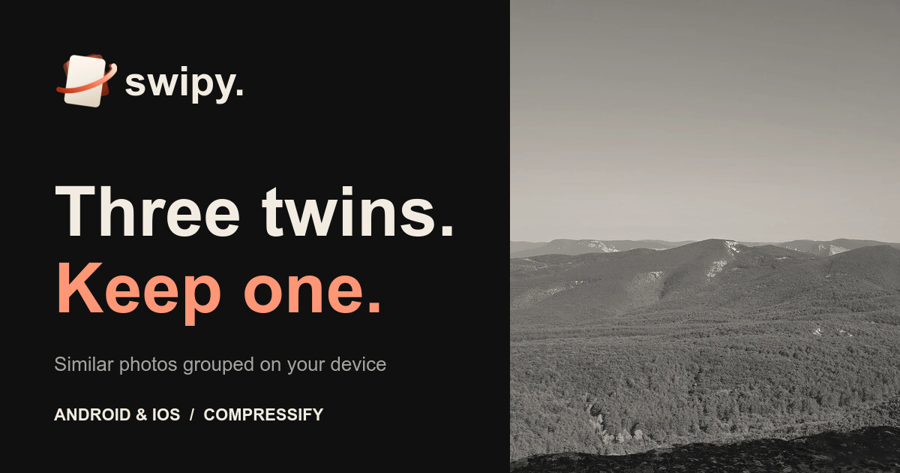

  

<h3 align="center">Sort photos with swipes, find duplicates and compress shots right on your phone.</h3>

  An app for Android and iOS · <b>in development</b> 
  <a href="https://compressify.pro">Swipy by Compressify</a>

---

Your gallery holds the shots that matter, and next to them dozens of duplicates, accidental photos and forgotten videos. Swipy helps you sort that archive bit by bit and keep what matters to you. Nothing is deleted without your confirmation.

  

**Sort with swipes.** Pick an album and go through photos and videos: favorites to the favorites, the rest to the deletion queue. Swipe directions and the double-tap action are yours to set. Review the queue before anything is removed; deletion starts only after you confirm.

  

**Compare similar shots.** Similar photos appear in groups right in the feed, and a separate search finds copies so you can pick what to keep. It runs on your device, and your favorites stay protected.

**Make photos lighter.** Swipe up to send JPEG, HEIC/HEIF and PNG photos to background compression without changing the resolution. The original joins the deletion queue only after the compressed copy is checked.

**Go at your own pace.** A small daily selection with a goal and a streak of days, optional reminders, filters by date, size and file type, light and dark themes, English and Russian.

---

  Questions and support: <a href="mailto:compressify@yandex.ru">compressify@yandex.ru</a>

