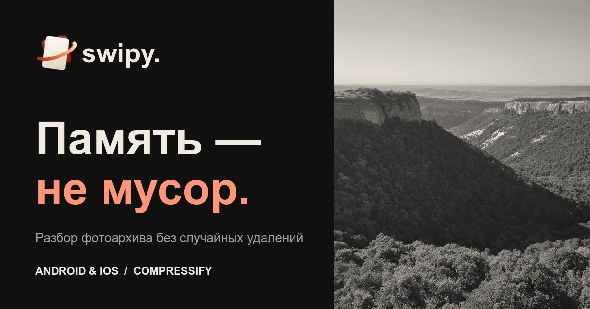
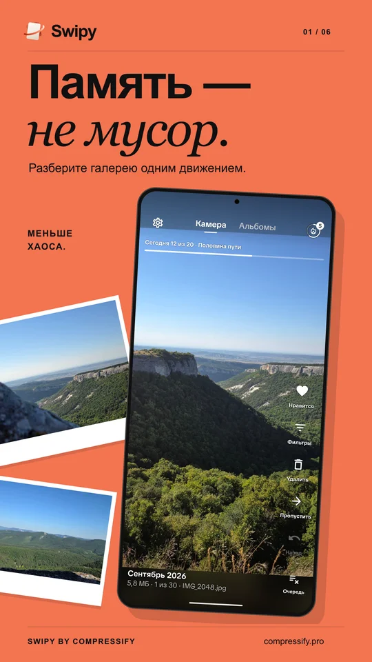
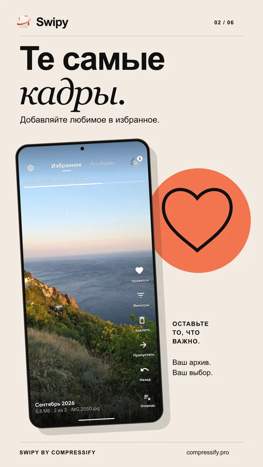
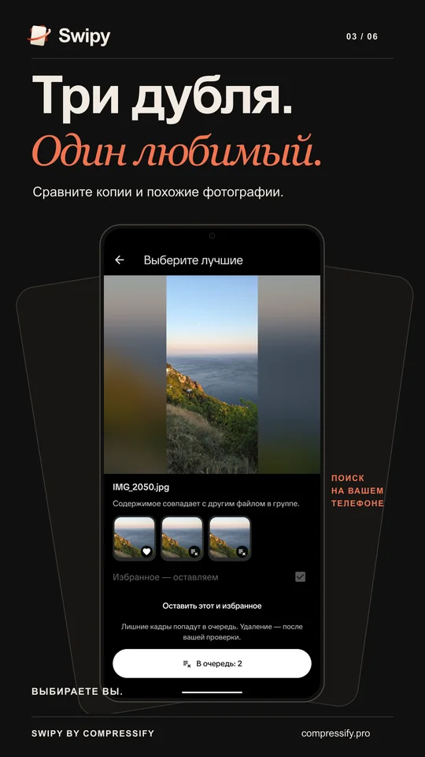
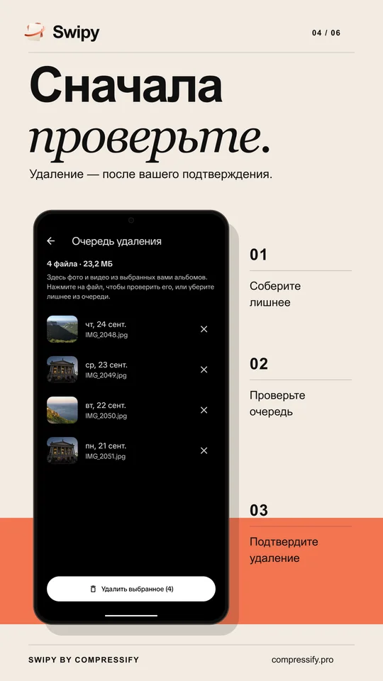
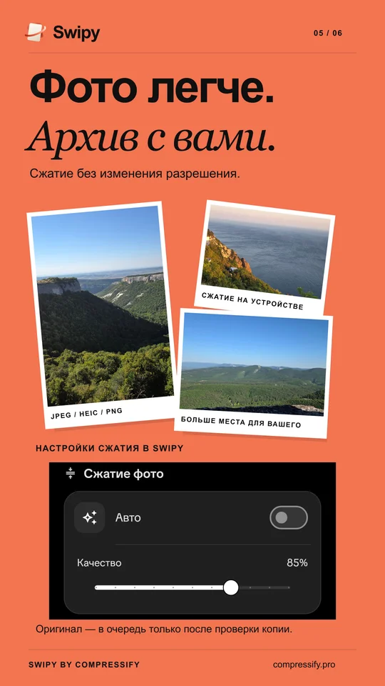
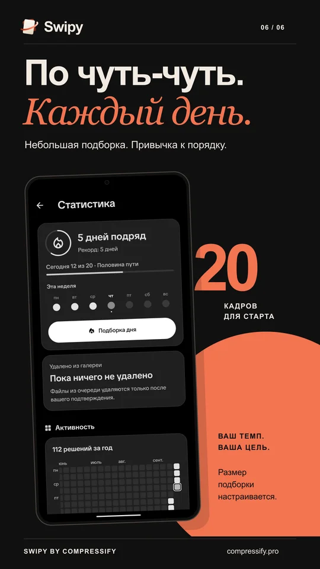

  

<h3 align="center">Разбирайте фото свайпами, находите дубли и сжимайте снимки на телефоне.</h3>

  Приложение для Android и iOS · <b>в разработке</b> 
  <a href="https://compressify.pro">Swipy by Compressify</a>

---

В галерее есть те самые кадры, а рядом — десятки дублей, случайных снимков и забытых видео. Swipy помогает разобрать этот архив постепенно и оставить то, что важно вам. Ничего не удаляется без вашего подтверждения.

<table>
  <tr>
    <td width="33%"></td>
    <td width="33%"></td>
    <td width="33%"></td>
  </tr>
  <tr>
    <td valign="top"><b>Разбор свайпами.</b> Выберите альбом, листайте фото и видео: любимое — в избранное, лишнее — в очередь. Жесты настраиваются.</td>
    <td valign="top"><b>Те самые кадры.</b> Избранное всегда под защитой — Swipy не предложит убрать его при выборе лишнего.</td>
    <td valign="top"><b>Похожие снимки.</b> Дубли и серии почти одинаковых кадров собраны в группы. Поиск работает на вашем устройстве.</td>
  </tr>
  <tr>
    <td></td>
    <td></td>
    <td></td>
  </tr>
  <tr>
    <td valign="top"><b>Сначала проверьте.</b> Свайп только добавляет кадр в очередь. Удаление начнётся после вашего подтверждения.</td>
    <td valign="top"><b>Фото легче.</b> Сжатие JPEG, HEIC и PNG без изменения разрешения. Оригинал попадает в очередь только после проверки копии.</td>
    <td valign="top"><b>По чуть-чуть.</b> Небольшая подборка дня, цель и серия дней. Напоминания — по желанию.</td>
  </tr>
</table>

## Под себя

Фильтры по дате, размеру и типу файла, светлая и тёмная темы, русский и английский языки. Шкалу прогресса и подсказки жестов можно отключить.

---

  Вопросы и поддержка: <a href="mailto:compressify@yandex.ru">compressify@yandex.ru</a>

